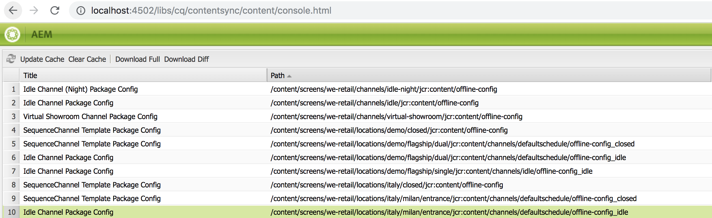

# ContentSync에서 SmartSync로 전환 {#transitioning-from-contentsync-to-smartsync}

이 섹션에서는 SmartSync 기능에 대한 개요와 서버 로드/스토리지 및 네트워크 트래픽을 최소화하여 비용을 줄이는 방법에 대해 설명합니다.

## 개요 {#overview}

SmartSync는 AEM Screens에서 사용하는 최신 메커니즘입니다. 오프라인 채널을 캐시하고 플레이어에 전달하는 데 사용되는 현재 방법을 대체하는 역할을 합니다.

서버측과 클라이언트측에서 모두 실행됩니다.

**서버측**:

* 자산을 포함한 채널의 컨텐츠는에서 캐시됩니다. */var/contentsync*.
* 캐시는 디스플레이에 사용할 수 있는 콘텐츠를 설명하는 매니페스트를 통해 플레이어에 노출됩니다.

**클라이언트측**:

* 플레이어는 위에 생성된 매니페스트를 기반으로 콘텐츠를 업데이트합니다.

### SmartSync 사용의 이점 {#benefits-of-using-smartsync}

SmartSync 기능은 AEM Screens 프로젝트에 많은 이점을 제공합니다. 허용

* 네트워크 트래픽 및 서버 측 스토리지 요구량 대폭 감소
* 플레이어는 자산이 없거나 변경된 경우에만 자산을 지능적으로 다운로드합니다
* 서버측 및 클라이언트측 스토리지 최적화

>[!NOTE]
>
>Adobe은 AEM Screens 프로젝트에 SmartSync를 사용할 것을 강력히 권장합니다.

## ContentSync에서 SmartSync로 마이그레이션 {#migrating-from-contentsync-to-smartsync}

>[!NOTE]
>
>AEM 6.3 기능 팩 5 및 AEM 6.4 기능 팩 3을 이미 설치한 경우 자산용 SmartSync를 활성화하여 디스크 공간 사용을 개선할 수 있습니다. SmartSync를 활성화하려면 아래 섹션에 따라 ContentSync에서 SmartSync로 전환하여 SmartSync를 활성화하십시오.
>
>SmartSync는 지원되는 서버 AEM 6.4.3 FP3을 사용하는 Screens Player에서 사용할 수 있습니다.
>
>다음을 참조하십시오. [AEM Screens 플레이어 다운로드](https://download.macromedia.com/screens/) 최신 플레이어를 다운로드하십시오. 다음 표에서는 각 플랫폼에 필요한 최소 플레이어 버전에 대해 설명합니다.

| **Platform** | **지원되는 최소 플레이어 버전** |
|---|---|
| Android | 3.3.72 |
| 크롬 OS | 1.0.136 |
| Windows | 1.0.136 |

ContentSync에서 SmartSync로 전환하려면 아래 단계를 따르십시오.

1. ContentSync에서 SmartSync로 마이그레이션하려면 SmartSync를 활성화하기 전에 ContentSync 캐시를 지워야 합니다.

   링크를 사용하여 인스턴스에서 ContentSync 콘솔로 이동합니다 ***https://localhost:4502/libs/cq/contentsync/content/console.html*** 및 클릭 **캐시 지우기**&#x200B;아래 그림과 같이

   

   >[!CAUTION]
   >
   >SmartSync를 처음 사용하기 전에 모든 컨텐츠 캐시를 지워야 합니다.

1. 다음으로 이동 **Adobe Experience Manager 웹 콘솔 구성** AEM 인스턴스 —> hammer 아이콘 —> 을 통해 **작업** —> **웹 콘솔**.

   

1. **Adobe Experience Manager 웹 콘솔 구성** 열림. 검색 대상 *offlinecontentservice*.

   검색용 **Screens Offline 콘텐츠 서비스** 속성, 누르기 **Command+F** 대상 **Mac** 및 **Ctrl+F** 대상 **Windows**.

   

1. 클릭 **저장** 을(를) 활성화하려면 **Screens Offline 콘텐츠 서비스** 따라서 AEM Screens용 SmartSync를 사용합니다.
1. SmartSync를 활성화했으면 프로젝트로 이동하여 을(를) 클릭해야 합니다. **오프라인 컨텐츠 업데이트** *(작업 표시줄에서)* 아래 그림과 같이.

   
