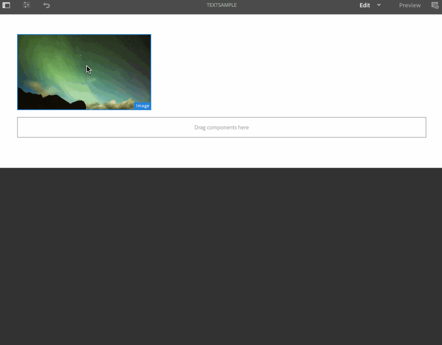

# 텍스트 오버레이 {#text-overlay}

이 섹션에서는 다음과 같은 주제를 다룹니다.

* **개요**
* **텍스트 오버레이 사용**
* **전제 조건**
* **텍스트 오버레이 속성 이해**

>[!CAUTION]
>
>텍스트 **오버레이** 기능은 AEM 6.3 기능 팩 5 또는 AEM 6.4 기능 팩 3을 설치한 경우에만 사용할 수 있습니다.

## 개요 {#overview}

텍스트 오버레이는 AEM Screens에서 사용할 수 있는 기능으로, 이미지 위에 제목이나 설명을 제공하여 시퀀스 채널에서 매력적인 경험을 만들 수 있습니다.

고유한 사용자 지정 구성 요소를 만드는 방법에 대한 자세한 내용은 AEM Screens 구성 **요소 확장을 참조하십시오**.

이 섹션에서는 AEM Screens 프로젝트에서 포스터 구성 요소를 사용하고 활용하는 방법을 소개하고 시퀀스 채널 중 하나에서 텍스트 오버레이로 사용하는 방법을 보여줍니다.

## 텍스트 오버레이 사용 {#using-text-overlay}

다음 섹션에서는 AEM Screens 프로젝트에서 텍스트 오버레이를 사용하는 방법에 대해 설명합니다.

**전제 조건**

이 기능을 구현하기 전에 텍스트 오버레이 구현을 시작하기 위한 전제 조건으로 프로젝트를 설정해야 합니다. 예,

* AEM Screens 프로젝트 만들기(이 예에서는 TextOverlayDemo ****)

* 채널 폴더 아래에 TextSample **이라는** 시퀀스 채널을 **만듭니다**

* TextSample 채널에 **컨텐츠** 추가

다음 이미지는 채널 폴더에 **TextSample** 채널이 있는 **TextOverlayDemo** 프로젝트를 **보여줍니다** .

AEM Screens 채널에서 텍스트 오버레이를 사용하려면 아래 절차를 따르십시오.

1. TextOverlayDemo **데모** —> 채널 **—>** 텍스트 **샘플로 이동하고** 편집을 **** 클릭하여 작업 표시줄에서 편집기를 엽니다.

   

1. 이미지를 선택하고 구성( **렌치** 아이콘)을 클릭하여 속성 대화 상자를 엽니다.

   

1. 아래 **그림과 같이** 대화 상자의 탐색 막대에서 텍스트 오버레이 옵션을 선택합니다.

   

### 텍스트 오버레이 속성 이해 {#understanding-text-overlay-properties}

텍스트 오버레이 속성을 사용하여 스크린 프로젝트의 구성 요소에 텍스트를 추가할 수 있습니다. 다음 섹션에서는 텍스트 오버레이에서 사용할 수 있는 속성에 대한 개요를 제공합니다.

텍스트 상자에 텍스트를 추가하고 굵게, 기울임체, 밑줄 등과 같은 타이포그래피 강조를 추가할 수 있습니다.

**색상 변형** 이 옵션을 사용하면 텍스트를 어둡게(검은색 텍스트) 또는 밝게(흰색 텍스트)로 지정할 수 있습니다.

**크기 조정 및 위치** 지정 이 옵션을 사용하면 텍스트를 가로 또는 세로로 정렬하거나 텍스트 정렬을 위해 세밀하게 정렬된 도구를 사용할 수 있습니다.

>[!NOTE]
>
>세밀하게 정렬된 툴을 제대로 사용하려면 접미어로(px)를 사용하여 올바른 위치를 픽셀 단위로 식별하십시오(예: 200px). 이 표현식의 결과는 시작점으로부터 200픽셀이 됩니다.

## 텍스트 오버레이에서 ContextHub 값 사용 {#using-text-overlay-context-hub}

다음 섹션에서는 텍스트 오버레이 구성 요소의 google 시트 등 데이터 저장소의 값 사용에 대해 설명합니다.

**전제 조건**

AEM Screens 프로젝트에 대한 ContextHub 구성을 설정해야 합니다.

데이터 저장소를 사용하여 데이터 기반 자산 변경 사항을 설정 및 관리하는 방법에 대한 자세한 내용은 AEM Screens에서 [ContextHub 구성을 참조하십시오](https://docs.adobe.com/content/help/en/experience-manager-screens/user-guide/developing/configuring-context-hub.html).

프로젝트에 필요한 구성을 설정했으면 아래 절차에 따라 google 시트의 값을 사용하십시오.

1. TextOverlayDemo **데모** —> **채널** —> **텍스트** 샘플 **속성을** 탐색하고 작업 표시줄에서 속성을 클릭합니다.

1. 개인화 **탭을 선택하여** ContextHub 구성을 설정합니다.

   1. ContextHub 경로를 **** libs **** 설정 **>** 설정 **> clouddefault** > DefaultConfigurationsBehance ContextBehaviorClickHub SelectSelect로 **** **** ****&#x200B;선택합니다.

   1. [ **세그먼트 경로** ]를 **conf로** 선택 > **화면** > **화면** > 설정 **** **** ****>wcmhcm > 세그먼트ClickSegments 선택

   1. Click **Save &amp; Close**.

      >[!NOTE]
      >
      >ContextHub 및 세그먼트 경로를 사용합니다. 여기서 처음에 컨텍스트 허브 구성 및 세그먼트를 저장했습니다.

      

1. TextOverlayDemo **데모** —> 채널 **—>** 텍스트 **샘플로 이동하고** 편집을 **** 클릭하여 작업 표시줄에서 편집기를 엽니다.

   

1. 이 페이지의 텍스트 오버레이 사용 섹션에 설명된 대로 이미지 및 텍스트 오버레이 구성 **요소를** 이미지에 추가합니다.

1. 구성( **렌치** 아이콘)을 클릭하여 이미지 **대화 상자를** 엽니다.

   

1. 이미지 **대화 상자에서 ContextHub** 탭으로 **이동합니다** . **추가**&#x200B;를 클릭합니다.

   >[!NOTE]
   >ContextHub 구성을 설정하지 않은 경우 프로젝트에 대해 이 옵션이 비활성화됩니다.

1. 자리 **표시자** 필드에 **값을** 입력하고 **Behavior 변수의 값을 가져올 행을** 선택합니다(이 경우, **컨텍스트 Google에서 2행 및 1행에서 검색되는 값이 검색됨)** . 그런 다음 아래 ****&#x200B;그림에 표시된 기본 시트와 20으로 기본 시트를 입력합니다. 완료되면 확인 표시를 클릭합니다.

   

   >[!NOTE]
   >참조용으로 다음 이미지는 google 시트에서 검색된 값을 보여줍니다.

   

1. 이미지 대화 **상자에서 텍스트 오버레이** 탭으로 다시 이동하고 아래 그림과 같이 *텍스트 현재 온도 {값}*&#x200B;을 추가합니다.

   

1. 미리 **보기를** 클릭하여 원하는 출력을 봅니다.

   

