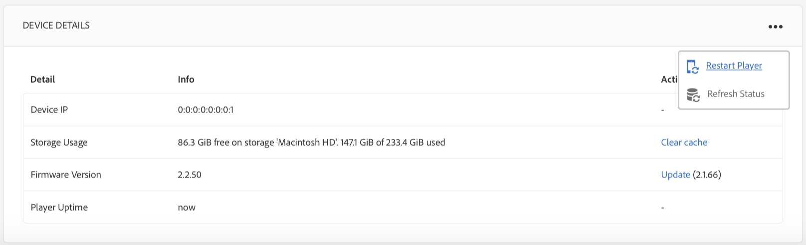

# 비디오 재생 구성 및 문제 해결 {#video-playback-configuration-and-troubleshooting}

DAM에 비디오를 업로드하고 채널을 추가하면 비디오가 Screens 플레이어에서 재생되지 않을 수 있는 문제가 발생할 수 있습니다.

다음 섹션에서는 채널에서 재생되는 비디오를 디버깅하고 문제를 해결하는 방법을 설명합니다.

## DAM 표현물 {#dam-renditions}

비디오를 채널에 업로드한 후에는 AEM에서 비디오에 대한 일부 변환을 만들기 시작해야 합니다. 자산 아래에서 비디오를 볼 수 있습니다.

비디오를 보려면:

1. 비디오(예: `http://localhost:4502/assets.html/content/dam/we-retail/en/videos`)로 이동합니다.
1. 비디오를 클릭하고 왼쪽 위 메뉴를 확장하고 **표현물**&#x200B;을 클릭합니다.

다른 표현물(MP4 또는 M4V)이 있어야 합니다.

변환이 없는 경우 AEM이 실행 중인 OS에 ffmpeg가 설치되어 있어야 합니다.

>[!CAUTION]
>
>변환이 없는 경우 AEM이 실행 중인 OS에 ffmpeg가 설치되어 있어야 합니다.
>
>ffmpeg를 설치하려면 [여기](https://www.ffmpeg.org/download.html)를 클릭하십시오.

## 비디오 자산 {#video-assets}

비디오 아래에 소스 속성이 없으면 비디오가 트랜스 코딩되지 않았을 수 있습니다. 비디오가 올바르게 코드 변환된 경우 아래 그림과 같이 대시보드에 표시됩니다.

ffmpeg가 설치되어 있고 비디오 프로필을 확인합니다.

### 비디오 프로필 {#checking-video-profile} 확인

1. **비디오 프로필**&#x200B;으로 이동하고, 즉 `http://localhost:4502/etc/dam/video.html`테스트 비디오 업로드&#x200B;**를 클릭합니다.**

   

1. 테스트 비디오를 업로드하고 **확인**&#x200B;을 클릭하여 코드 변환을 시작합니다.

   코드 변환이 실패하는 경우 ffmpeg 출력을 확장하여 ffmpeg의 콘솔 출력 오류를 파악합니다.

   

   또한 비디오 트랜스코딩이 성공적으로 코드 변환된 파일을 다운로드할 수 있습니다.

   

   >[!NOTE]
   >
   >모든 채널에 비디오를 추가하기 전에 비디오를 트랜스코딩할 충분한 시간을 제공해야 합니다(처리하는 대신 새 태그를 보여 주어야 함).

### 비디오 구성 요소 {#checking-profile-with-a-video-component}에서 프로필 확인

비디오 구성 요소가 제대로 구성되지 않은 경우 페이지 디자인에서 프로필 목록을 확인하십시오.

1. 채널로 이동하고 **디자인** 모드를 선택합니다.

   

1. 비디오를 선택하고 **편집** 대화 상자를 엽니다. **프로필** 탭을 엽니다.

   >[!NOTE]
   >다른 프로파일을 선택합니다(적어도 &quot;고품질 H.264&quot; 프로필이 있어야 함).

### 웹 플레이어 {#checking-the-video-in-the-web-player}에서 비디오 확인

브라우저(Chrome 및 Safari)에서 재생 여부를 확인하려면 **웹 플레이어** `http://localhost:4502/content/mobileapps/cq-screens-player/firmware.html/content/screens/we-retail/locations/demo/flagship/single/device0`를 사용합니다. Safari는 OSX 및 iOS 브라우저인 반면 Chrome은 Android 장치에서 사용됩니다.

비디오가 Safari에서 실행되지 않으면 OSX 및 iOS 플레이어에서 실행되지 않습니다. 이 문제는 인코딩 문제이므로 비디오를 다시 인코딩해야 합니다.

DAM 워크플로우를 사용하여 FullHD 표현물을 만들려면 다음 단계를 수행하십시오.

1. *워크플로우 모델 관리자*&#x200B;인 `http://localhost:4502/libs/cq/workflow/admin/console/content/models.html/etc/workflow/models`로 이동합니다.
1. **스크린 자산 업데이트** 모델을 선택합니다.
1. 작업 표시줄에서 **워크플로우 시작**&#x200B;을 클릭하여 **워크플로우 실행** 대화 상자를 엽니다.

1. **페이로드**&#x200B;에서 비디오 자산을 선택합니다.
1. **실행**&#x200B;을 클릭합니다.

>[!NOTE]
>
>변환을 만드는 데 약간의 시간이 소요될 수 있지만, 몇 초/분(비디오 크기에 따라 다름) 후에는 Safari에서 웹 플레이어를 다시 로드하십시오.

#### 자동 재생 정책 플래그 문제 해결 {#troubleshooting-autoplay-policy-flag}

AEM Screens 플레이어는 비디오를 선택하지만 표시되지 않는 경우 자동 재생 정책 플래그 문제를 해결해야 합니다.

Google의 자동 재생 정책 플래그 문제를 해결하려면 아래 절차를 따르십시오.

1. ***chrome://flags/#autoplay-policy***&#x200B;로 이동합니다.
1. **자동 재생 정책**&#x200B;을 **기본**&#x200B;에서 **사용자 제스처가 필요하지 않음**

1. 웹 브라우저를 다시 실행하고 플레이어를 업데이트합니다.

>[!NOTE]
>
>Chrome의 새로운 자동 재생 정책을 통해 사용자 경험에 대한 우수 사례에 대한 자세한 내용은 *자동 재생 정책 변경 사항*(즉, `https://developers.google.com/web/updates/2017/09/autoplay-policy-changes#webaudio`에 대한 설명서를 참조하십시오.

### 여러 플레이어에서 비디오 동기화 {#syncing-video-across-multiple-players}

여러 장치에서 비디오를 동기식으로 재생하려면 비디오가 포함된 시퀀스에 대한 절대 전략을 사용해야 합니다.

#### 요구 사항 {#requirements}

* 동일한 2개 이상의 플레이어
* 이상적인 하드웨어
* 동일한 네트워크 토폴로지(플레이어가 내부 시스템 시간을 정렬하는 NTP 서버에 연결됨)

#### 절대 전략 설정 {#setting-up-the-absolute-strategy}

절대 전략:

* 기준점 시간(현재 날짜의 자정)을 계산합니다.
* 시퀀스의 지속 시간을 계산합니다(모든 항목의 지속 시간 합).
* 언제든지 시퀀스 _remaining_time = (current_time - anchor_time) % sequence_duration을 해결하여 현재 재생할 항목과 다음 항목을 계산합니다.

아래 절차에 따라 절대 전략을 설정합니다.

1. 채널 작성자로 이동하여 아래 그림과 같이 시퀀스 구성 요소를 선택합니다.
1. 구성 대화 상자를 엽니다.
1. **전략**&#x200B;을 편집하고 절대값을 추가합니다.

   

   >[!NOTE]
   >선수들의 OS는 같은 시계를 가지고 있어야 한다.

**OS XF에서 시계** 정렬OSX에서 시계를 정렬하려면 아래 단계를 따르십시오.

1. 각 OSX 상자에서 **날짜 및 시간** 기본 설정을 엽니다.
1. **날짜 및 시간을 자동으로 설정**
1. 드롭다운에 값 0.pool.ntp.org, 1.pool.ntp.org, 2.pool.ntp.org, 3.pool.ntp.org, time.apple.com을 붙여넣거나 단순히 *sudo ntpdate -u -v 0.pool.ntp.org*
1. 2개 이상의 플레이어 시작

플레이어가 새 정렬 시퀀스를 시작하기 전에 시간이 걸릴 수 있습니다.

