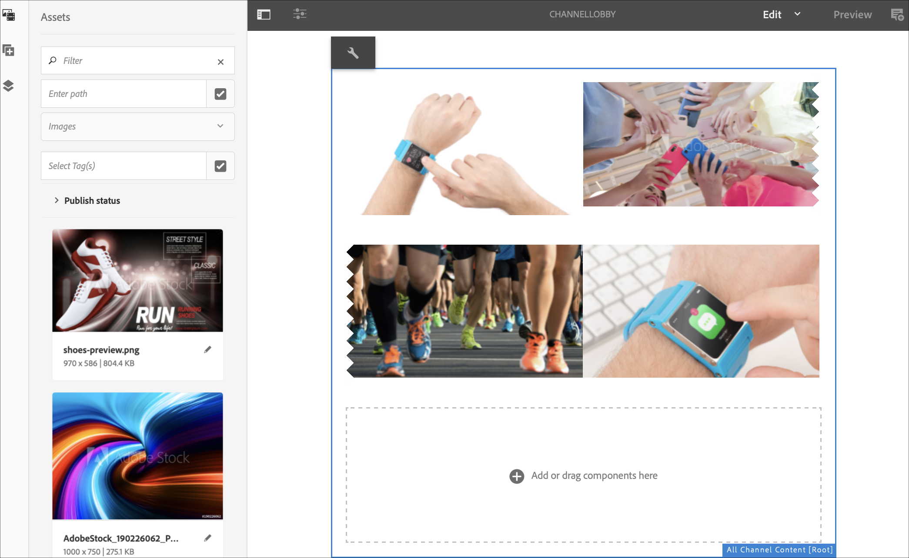

# 명령 동기화 {#command-sync}

다음 페이지에서는 명령 동기화를 사용하는 방법에 대해 설명합니다. 명령 동기화를 사용하면 여러 플레이어에서 동기화된 재생을 사용할 수 있습니다. 플레이어는 다른 콘텐츠를 재생할 수 있지만 각 에셋의 지속 시간은 동일해야 합니다.

>[!IMPORTANT]
>
>이 기능은 포함된 시퀀스, 동적 포함된 시퀀스, 응용 프로그램 채널 또는 전환을 지원하지 않습니다.

## 개요 {#overview}

디지털 간판 솔루션은 비디오 월 및 동기화된 재생을 지원해야 합니다. 이 시나리오는 새해 카운트다운이나 여러 화면에서 재생하기 위해 얇게 썬 큰 비디오와 같은 시나리오를 지원하려는 경우에 적용됩니다. 이러한 시나리오에서는 명령 동기화가 실행됩니다.

명령 동기화를 사용하려면 한 플레이어가 *기본* 역할을 하고 명령을 전송하면 다른 플레이어는 모두 *클라이언트* 역할을 하고 명령을 받으면 재생합니다.

*primary*&#x200B;은(는) 항목 재생을 시작하려고 할 때 등록된 모든 클라이언트에 명령을 보냅니다. 이 작업의 페이로드는 재생할 항목의 인덱스이거나 재생할 요소의 외부 html 또는 둘 다일 수 있습니다.

## 명령 동기화 구현 {#using-command-sync}

다음 섹션에서는 AEM Screens 프로젝트에서 명령 동기화를 사용하는 방법에 대해 설명합니다.

>[!NOTE]
>
>동기화된 재생을 위해, 모든 하드웨어 장치들이 동일한 하드웨어 사양들 및 바람직하게는 동일한 운영 체제를 갖는 것이 요구된다. 서로 다른 하드웨어와 운영 체제 간의 동기화는 권장되지 않습니다.

### 프로젝트 설정 {#setting-up}

명령 동기화 기능을 사용하기 전에 프로젝트와 채널에 프로젝트의 콘텐츠가 설정되어 있는지 확인하십시오.

1. 다음 예제에서는 데모 프로젝트 **CommandSyncDemo** 및 시퀀스 채널 **ChannelLobby**&#x200B;을(를) 보여 줍니다.

   

   >[!NOTE]
   >
   >채널을 만들거나 채널에 콘텐츠를 추가하는 방법은 [채널 만들기 및 관리](/help/user-guide/managing-channels.md)를 참조하세요.

   이 채널에는 아래 그림과 같이 다음 콘텐츠가 포함되어 있습니다.

   

1. 아래 그림과 같이 **로비** 위치를 만든 다음 **위치** 폴더에서 **LobbyDisplay**(으)로 제목이 지정된 디스플레이를 만듭니다.
   

1. **LobbyDisplay**&#x200B;에 **ChannelLobby** 채널을 할당하십시오. 이제 디스플레이 대시보드에서 디스플레이에 할당된 채널을 볼 수 있습니다.
   

   >[!NOTE]
   >
   >디스플레이에 채널을 할당하는 방법에 대한 자세한 내용은 [디스플레이 만들기 및 관리](/help/user-guide/managing-displays.md)를 참조하세요.

1. **장치** 폴더로 이동합니다.
1. 작업 표시줄에서 **장치 관리자**&#x200B;를 클릭합니다.

   

   >[!NOTE]
   >
   >장치를 등록하는 방법에 대해 알아보려면 [장치 등록](/help/user-guide/device-registration.md)을 참조하세요.

1. 이 예에서는 데모 목적으로 Chrome 장치와 Windows Player를 두 개의 개별 장치로 보여 줍니다. 두 장치 모두 동일한 디스플레이를 가리킵니다.
   

### 채널 설정 업데이트 중

1. **ChannelLobby**(으)로 이동합니다.
1. 작업 표시줄에서 **편집**&#x200B;을 클릭합니다.
1. 아래 그림과 같이 전체 채널을 클릭합니다.
   

1. 렌치 아이콘을 클릭합니다.
   

1. **페이지** 대화 상자의 **전략** 필드에 *synced* 키워드를 입력합니다.
   

### 기본 설정 {#setting-up-primary}

1. **CommandSyncDemo** > **위치** > **로비** > **로비 디스플레이**&#x200B;에서 디스플레이 대시보드로 이동합니다. 작업 표시줄에서 **대시보드**&#x200B;를 클릭합니다.
**장치** 패널에서 두 장치(Chrome 및 Windows Player)를 확인합니다. 자세한 내용은 다음과 같습니다.
   

1. **장치** 패널에서 기본으로 설정할 장치를 클릭합니다. 다음 예에서는 Chrome 장치를 기본 장치로 설정하는 방법을 보여 줍니다. **기본 장치로 설정**&#x200B;을 클릭합니다.

   

1. **기본 장치로 설정**&#x200B;에 IP 주소를 입력하고 **저장**&#x200B;을 클릭합니다.

   

>[!NOTE]
>
>여러 장치를 기본 장치로 설정할 수 있습니다.

### 기본과 동기화 중 {#sync-up-primary}

1. Chrome 장치를 기본 장치로 설정한 후 다른 장치(이 경우 Windows Player)를 동기화하여 기본 장치와 동기화합니다.
**장치** 패널에서 다른 장치(이 경우 Windows Player)를 클릭하고 **기본 장치에 동기화**&#x200B;를 클릭합니다.

   

1. 목록에서 장치를 클릭하고 **저장**&#x200B;을 클릭합니다.

   >[참고:]
   > **기본 장치와 동기화** 대화 상자에 기본 장치 목록이 표시됩니다. 원하는 항목을 선택합니다.

1. 장치(Windows Player)가 기본 장치(Chrome Player)에 동기화되면 장치가 **장치** 패널에서 동기화되는 것을 볼 수 있습니다.

   

### 기본과 동기화 해제 {#desync-up-primary}

장치를 기본 장치에 동기화한 후 해당 장치에서 할당을 비동기화할 수 있습니다.

>[!NOTE]
>
>기본 장치의 동기화를 해제하면 해당 기본 장치와 연결된 모든 클라이언트 장치의 연결도 해제됩니다.

기본 장치에서 동기화를 제거하려면 아래 단계를 수행하십시오.

1. **장치** 패널로 이동하고 장치를 클릭합니다.

1. 기본 장치에서 클라이언트를 비동기화하려면 **장치 동기화 해제**&#x200B;를 클릭하십시오.

   

1. 기본 장치에서 선택한 장치를 동기화하지 않으려면 **확인**&#x200B;을 클릭하십시오.

   >[참고:]
   > 기본 장치를 클릭하고 동기화 해제 옵션을 사용하면 기본 장치에 연결된 모든 장치가 한 단계에서 동기화되지 않습니다.
