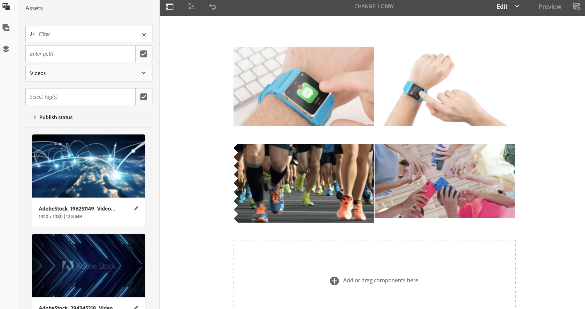

# 명령 동기화 {#command-sync}

다음 페이지에서는 명령 동기화를 사용하는 방법에 대해 설명합니다. 명령 동기화를 사용하면 여러 플레이어에서 동기화된 재생을 수행할 수 있습니다. 플레이어는 다른 콘텐츠를 재생할 수 있지만 각 에셋의 지속 시간은 같아야 합니다.

>[!IMPORTANT]
>이 기능은 포함된 시퀀스, 동적 포함된 시퀀스, 응용 프로그램 채널 또는 전환을 지원하지 않습니다.

## 개요 {#overview}

디지털 사이니지 솔루션은 새해 카운트다운과 같은 시나리오를 지원하기 위해 비디오 벽과 동기화된 재생을 지원해야 합니다. 또는 여러 화면에서 재생할 수 있도록 확대된 대형 비디오 등이 여기에 해당합니다.

명령 동기화를 사용하려면 한 플레이어가 *마스터* 역할을 하고 명령을 보내고 다른 모든 플레이어는 *클라이언트* 역할을 하며 명령을 받을 때 재생합니다.

마스터가 ** 항목의 재생을 시작할 때 등록된 모든 클라이언트에 명령을 전송합니다. 이 페이로드의 페이로드는 재생할 항목의 색인이거나 재생할 요소의 외부 html일 수 있습니다.

## 명령 동기화 구현 {#using-command-sync}

다음 섹션에서는 AEM Screens 프로젝트에서 명령 동기화를 사용하는 방법에 대해 설명합니다.

>[!NOTE]
>동기화된 재생의 경우 모든 하드웨어 장치에 동일한 하드웨어 사양이 있어야 하며 특히 동일한 운영 체제가 필요합니다. 다른 하드웨어와 운영 체제 간의 동기화는 권장되지 않습니다.

### 프로젝트 설정 {#setting-up}

명령 동기화 기능을 사용하기 전에 프로젝트에 대해 설정된 컨텐츠가 있는 프로젝트와 채널이 있는지 확인하십시오.

1. 다음 예에서는 CommandSyncDemo라는 데모 프로젝트와 **시퀀스 채널** ChannelLobby를 **보여줍니다**.

   

   >[!NOTE]
   >
   >채널을 만들거나 채널에 컨텐츠를 추가하는 방법에 대한 자세한 내용은 채널 [만들기 및 관리를 참조하십시오](/help/user-guide/managing-channels.md)

   채널에는 아래 그림과 같이 다음 컨텐츠가 포함되어 있습니다.

   

1. 아래 그림과 같이 **위치** 폴더에 디스플레이를 만듭니다.
   

1. ChannelLobby 채널을 **Lobby** Display에 **할당합니다**.
   

   >[!NOTE]
   >
   >디스플레이에 채널을 지정하는 방법에 대한 자세한 내용은 디스플레이 [만들기 및 관리를 참조하십시오](/help/user-guide/managing-displays.md).

1. 장치 **폴더로 이동하고** 작업 **표시줄에서 장치** 관리자를 클릭하여 장치를 등록합니다.

   

   >[!NOTE]
   >
   >디스플레이에 채널을 지정하는 방법에 대한 자세한 내용은 디스플레이 [만들기 및 관리를 참조하십시오](/help/user-guide/managing-displays.md)

1. 데모 목적으로 이 예는 크롬 장치와 Windows 플레이어를 두 개의 별도 장치로 보여줍니다. 두 장치 모두 동일한 디스플레이를 가리킵니다.
   

### 채널 설정 업데이트

1. ChannelLobby **로** 이동하고 작업 **표시줄에서 편집을 클릭하여** 채널 설정을 업데이트합니다.

1. 아래 그림과 같이 전체 채널을 선택합니다.
   

1. 렌치 아이콘을 클릭하여 페이지 **대화 상자를** 엽니다.
   

1. 전략 필드에 *동기화된* 키워드를 **입력합니다** .

   

### 마스터 설정 {#setting-up-master}

1. CommandSyncSyncLocation —> **위치** —> Lobby **** Lobby **—> Lobby** DisplayDashboard **** **** 를 클릭하고 작업 표시줄에서 디스플레이 대시보드를 클릭합니다.
아래 그림에서와 같이 DEVICES **패널에서 두 개의** 장치(크롬 및 Windows 플레이어)가 표시됩니다.
   

1. 장치 **패널에서** 마스터로 설정할 장치를 선택합니다. 다음 예제에서는 Chrome 장치를 마스터로 설정하는 방법을 보여 줍니다. 마스터 **장치로**&#x200B;설정을 클릭합니다.

   

1. 마스터 장치로 **설정에서 IP 주소를 입력하고 저장을** 클릭합니다 ****.

   

>[!NOTE]
> 여러 장치를 마스터로 설정할 수 있습니다.

### 마스터와 동기화 {#sync-up-master}

1. Chrome 장치를 마스터로 설정하면 다른 장치(이 경우 Windows 플레이어)를 동기화하여 마스터와 동기화할 수 있습니다.
장치 패널에서 다른 장치(이 경우 Windows 플레이어) **를** 선택하고 **아래 그림과 같이 마스터 장치에**&#x200B;동기화를 클릭합니다.

   

1. 목록에서 장치를 선택하고 저장을 **클릭합니다**.

   >[메모:]
   > 마스터 **장치에** 동기화 대화 상자에 마스터 장치 목록이 표시됩니다. 원하는 환경 설정 중 하나를 선택할 수 있습니다.

1. 장치(Windows 플레이어)가 마스터(Chrome 플레이어)에 동기화되면 장치 **패널에 동기화되는 장치가** 표시됩니다.

   

### 마스터와 동기화 취소 {#desync-up-master}

장치나 장치를 마스터에 동기화하면 해당 장치에서 할당을 동기화 해제할 수 있습니다.

>[!NOTE]
>마스터 장치를 해제하면 해당 마스터 장치와 연결된 모든 클라이언트 장치도 연결을 해제합니다.

마스터 장치에서 동기화를 제거하려면 아래 단계를 따르십시오.

1. 장치 **패널로** 이동하여 장치를 선택합니다.

1. Design **device(s)** 를 클릭하여 마스터 장치에서 클라이언트를 동기화합니다.

   

1. 확인을 **클릭하여** 선택한 장치를 마스터에서 동기화하지 않습니다.

   >[메모:]
   > 마스터 장치를 선택하고 동기화 해제 옵션을 사용하면 마스터에 연결된 모든 장치가 한 번에 동기화됩니다.
