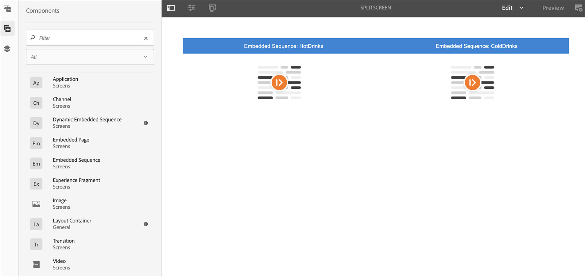
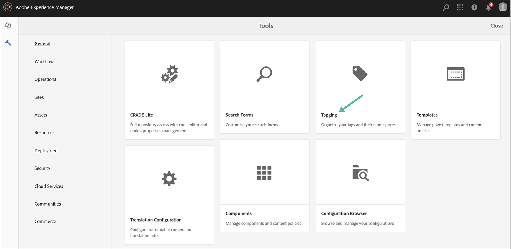

# AEM Screens의 음성 인식 {#voice-recognition}

>[!IMPORTANT]
>
>**중요 개인 정보**
>
>음성 인식 기능을 사용하는 경우 해당 지역에 적용 가능한 모든 법적 및 윤리적 지침을 따르십시오(플레이어가 음성 인식을 사용하고 있음을 최종 사용자에게 알리는 것을 포함하되 이에 제한되지 않음). Adobe Inc. 음성 관련 정보를 수신, 저장 또는 처리하지 않습니다. AEM Screens 플레이어는 검색 엔진에 빌드된 표준 웹 음성 API를 사용합니다. 백그라운드에서 이 API는 음성 변환 시 Google 서버에 음성 양식을 전송하여 텍스트 변환 시 이 텍스트가 구성된 키워드에 대해 플레이어에 의해 일치됩니다.
>
>자세한 내용은 웹 음성 API](https://www.google.com/chrome/privacy/whitepaper.html#speech)의 [Google 개인 정보 보호 백서를 참조하십시오.

음성 인식 기능을 사용하면 음성 상호 작용으로 구동되는 AEM Screens 채널에서 컨텐츠를 변경할 수 있습니다.

컨텐츠 작성자는 디스플레이가 음성을 사용하도록 구성할 수 있습니다. 이 기능의 목적은 고객이 음성 기능을 디스플레이와 상호 작용하는 방법으로 활용할 수 있도록 하는 것입니다. 비슷한 사용 사례로는 상점에서 제품 추천 찾기, 저녁식당의 메뉴 항목 주문 등이 있습니다. 이 기능은 사용자의 접근성을 높이고 고객 경험을 크게 향상시킬 수 있습니다.

>[!NOTE]
>플레이어 하드웨어는 마이크와 같은 음성 입력을 지원해야 합니다.

## 음성 인식 구현 {#implementing}

>[!IMPORTANT]
> 음성 인식 기능은 Chrome OS 및 Windows 플레이어에서만 사용할 수 있습니다.

AEM Screens 프로젝트에서 음성 인식을 구현하려면 디스플레이에 대한 음성 인식을 활성화하고 각 채널을 고유한 태그와 연결하여 채널 전환을 트리거해야 합니다.

다음 섹션에서는 AEM Screens 프로젝트에서 음성 인식 기능을 활성화하고 사용하는 방법에 대해 설명합니다.

## 전체 화면 또는 분할 화면 채널 스위치에서 컨텐츠 보기 {#sequence-channel}

음성 인식 기능을 사용하기 전에 프로젝트에 대해 설정된 컨텐츠가 있는 프로젝트와 채널이 있는지 확인하십시오.

1. 다음 예에서는 아래 그림과 같이 **VoiceDemo** 및 세 개의 시퀀스 채널 **Main**, **ColdDrinks** 및 **HotDrinks**&#x200B;이 있는 데모 프로젝트를 소개합니다.

   

   >[!NOTE]
   >
   >채널을 만들거나 채널에 컨텐츠를 추가하는 방법에 대해 알려면 [채널 만들기 및 관리](/help/user-guide/managing-channels.md) 를 참조하십시오

   또는,

   아래 그림과 같이 3개의 시퀀스 채널 **주**, **ColdDrines** 및 **HotDrinks** 및 1x2 분할 화면 채널 **SplitScreen**&#x200B;을 만들 수 있습니다.

   

1. 각 채널로 이동하고 컨텐츠를 추가합니다. 예를 들어, **VoiceDemo** —> **채널** —> **주**&#x200B;로 이동하여 채널을 선택합니다. 작업 표시줄에서 **편집**&#x200B;을 클릭하여 편집기를 열고 필요에 따라 컨텐츠(이미지/비디오)를 추가합니다. 마찬가지로 **ColdDrinks** 및 **HotDrinks** 채널 모두에 컨텐츠를 추가합니다.

   이제 채널에는 아래 그림과 같이 자산(이미지)이 포함됩니다.

   **기본**:

   

   **콜드 드링크**:

   

   **핫 드링크**:

   

   프로젝트에 분할 화면 채널을 추가한 경우 **SplitScreen**&#x200B;으로 이동하여 포함된 두 개의 시퀀스를 드래그 앤 드롭하고 아래 그림과 같이 **ColdDrinks** 및 **HotDrinks** 채널에 경로를 추가합니다.
   

### 채널용 태그 설정 {#setting-tags}

채널에 컨텐츠를 추가한 후에는 각 채널로 이동하고 음성 인식을 트리거하는 적절한 태그를 추가해야 합니다.

채널에 태그를 추가하려면 아래 절차를 따르십시오.

1. 각 채널로 이동하고 컨텐츠를 추가합니다. 예를 들어, **VoiceDemo** —> **채널** —> **주**&#x200B;로 이동하여 채널을 선택합니다.

1. 작업 표시줄에서 **속성**&#x200B;을 클릭합니다.

   

1. **기본 사항** 탭으로 이동하여 **태그** 필드에서 이미 존재하는 태그를 선택하거나 새 태그를 만듭니다.

   아래 그림과 같이 태그의 새 이름을 입력하고 `return` 키를 눌러 새 태그를 만들 수 있습니다.

   

   또는,

   프로젝트에 대해 미리 AEM 인스턴스에서 태그를 만들고 선택할 수도 있습니다. [태그 만들기](#creating-tags)에 설명된 단계를 수행하면 위치에서 태그를 선택하고 아래 그림과 같이 채널에 추가할 수 있습니다.

   

1. 마찬가지로 **hot**&#x200B;라는 태그를 **HotDrinks** 채널에 추가합니다.

1. 분할 화면 채널을 사용하는 경우 아래 그림과 같이 태그(**hot** 및 **cold**)를 모두 **SplitScreen** 채널 속성에 추가합니다.

   

1. 완료되면 **저장 및 닫기**&#x200B;를 클릭하십시오.

### 태그 만들기 {#creating-tags}

태그를 만들려면 아래 절차를 따르십시오.

1. AEM 인스턴스로 이동합니다.

1. 도구 아이콘 —> **태깅**을 클릭합니다.
   

1. **만들기** —> **네임스페이스 만들기**를 클릭합니다.
   

1. 프로젝트 이름(예: **VoiceDemo**)을 입력하고 **만들기**&#x200B;를 클릭합니다.

1. **VoiceDemo** 프로젝트를 선택하고 작업 표시줄에서 **태그 만들기**를 클릭합니다.
   

1. 태그 이름을 입력하고 **제출**을 클릭합니다.
   

이제 AEM Screens 프로젝트에서 이러한 태그를 사용할 수 있습니다.

### 디스플레이에 채널 지정 및 음성 인식 활성화 {#channel-assignment}

1. 아래 그림과 같이 **위치** 폴더에 디스플레이를 만듭니다.

   

   >[!NOTE]
   >디스플레이에 채널을 지정하는 방법에 대한 자세한 내용은 [디스플레이 만들기 및 관리](/help/user-guide/managing-displays.md)를 참조하십시오.

1. **주**, **ColdDrug** 및 **HotDrues** 채널을 **LobbyDisplay**&#x200B;에 할당합니다. 또한 프로젝트에 **SplitScreen** 채널을 사용하는 경우 디스플레이에 할당해야 합니다.

   >[!NOTE]
   >분할 화면 채널을 만든 경우 디스플레이에 **SplitScreen** 채널을 지정하십시오.

1. 채널을 지정하는 동안 다음 속성을 각 채널로 설정합니다.

   | **채널 이름** | **우선 순위** | **지원되는 이벤트** |
   |---|---|---|
   | 기본 | 2 | 초기 로드, 유휴 화면, 타이머 |
   | 핫 드링크 | 1 | 사용자 상호 작용 |
   | 콜드음료 | 1 | 사용자 상호 작용 |
   | 분할 화면 | 1 | 사용자 상호 작용 |

   >[!NOTE]
   >
   >디스플레이에 채널을 지정하는 방법에 대한 자세한 내용은 [디스플레이 만들기 및 관리](/help/user-guide/managing-displays.md)를 참조하십시오.

1. 디스플레이에 채널을 지정했으면 **LobbyDisplay**&#x200B;로 이동하여 디스플레이를 선택하십시오. 작업 표시줄에서 **속성**&#x200B;을 선택합니다.

1. **Display** 탭으로 이동하여 **Content**&#x200B;에서 **Voice enabled** 옵션을 활성화합니다.

   

   >[!IMPORTANT]
   >디스플레이에서 음성 인식 기능을 사용하도록 설정해야 합니다.

### Chrome 플레이어에서 컨텐츠 보기 {#viewing-content}

앞의 단계가 완료되면 chrome 장치를 등록하여 출력을 볼 수 있습니다.

>[!NOTE]
>AEM Screens 플레이어에서 장치를 등록하는 방법에 대해 알아보려면 [장치 등록](device-registration.md) 을 참조하십시오.

**시퀀스 채널에 대해 원하는 출력**

**주** 채널에서 콘텐츠를 재생하고 있지만, *와 같이 키워드&#x200B;**hot**를 사용하는 경우,**핫 음료* 채널을 재생하기 시작합니다.**

마찬가지로, **cold**(예: *찬*&#x200B;과 같은 키워드가 있는 단어를 사용하는 경우, 채널은 **ColdDrinks** 채널의 컨텐츠를 재생하기 시작합니다.

**분할 화면 채널에 대해 원하는 출력**

**Main** 채널에서 콘텐츠를 재생하고 있지만 키워드 **hot** 및 **cold**&#x200B;와 함께 *핫 및 콜드 음료*&#x200B;에 대한 메뉴를 보려면 **SplitScreen** 채널의 내용을 재생하기 시작합니다. *을 기본 메뉴*&#x200B;로 돌아가면 기본 채널로 다시 전환합니다.
