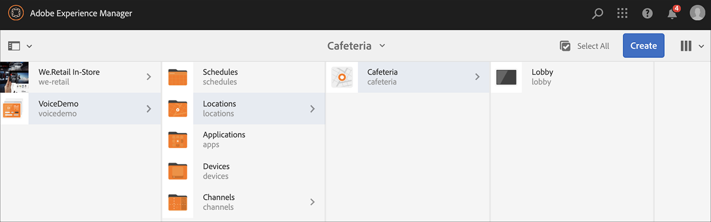

# AEM Screens의 음성 인식 {#voice-recognition}

>[!IMPORTANT]
>
>**중요한 개인 정보**
>
>음성 인식 기능을 사용하는 경우 해당 지역에 적용되는 모든 법적 및 윤리적 지침을 따르십시오(플레이어가 음성 인식을 사용하고 있음을 최종 사용자에게 알리는 것을 포함하지만 이에 국한되지 않음). Adobe은 음성 관련 정보를 수신, 저장 또는 처리하지 않습니다. AEM Screens 플레이어는 검색 엔진에 내장된 표준 웹 음성 API를 사용합니다. 백그라운드에서 이 API는 음성의 웨이브 양식을 Google 서버로 전송하여 음성에서 텍스트로 변환하고 이 텍스트는 플레이어에서 구성된 키워드에 대해 일치합니다.
>
>다음을 참조하십시오 [웹 스피치 API에 대한 Google 개인정보 보호 백서](https://www.google.com/chrome/privacy/whitepaper.html#speech) 을 참조하십시오.

음성 인식 기능을 사용하면 음성 상호 작용에 의해 AEM Screens 채널에서 콘텐츠를 변경할 수 있습니다.

콘텐츠 작성자는 음성이 활성화되도록 디스플레이를 구성할 수 있습니다. 이 기능의 목적은 고객이 디스플레이와 상호 작용하는 방법으로 음성을 사용할 수 있도록 하는 것입니다. 이와 유사한 사용 사례로는 매장에서 제품 추천을 받거나, 저녁 식사 및 레스토랑에서 메뉴 항목을 주문하는 것이 있습니다. 이 기능은 사용자의 접근성을 높이고 고객 경험을 크게 향상시킬 수 있습니다.

>[!NOTE]
>플레이어 하드웨어는 마이크로폰과 같은 음성 입력을 지원해야 한다.

## 음성 인식 구현 {#implementing}

>[!IMPORTANT]
> 음성 인식 기능은 Chrome OS 및 Windows 플레이어에서만 사용할 수 있습니다.

AEM Screens 프로젝트에서 음성 인식을 구현하려면 표시에 대해 음성 인식을 활성화하고 각 채널을 고유한 태그와 연결하여 채널 전환을 트리거합니다.

다음 섹션에서는 AEM Screens 프로젝트에서 음성 인식 기능을 활성화하고 사용하는 방법에 대해 설명합니다.

## 전체 화면 또는 분할 화면 채널 전환으로 컨텐츠 보기 {#sequence-channel}

음성 인식 기능을 사용하기 전에 프로젝트와 채널에 프로젝트의 콘텐츠가 설정되어 있는지 확인하십시오.

1. 다음 예제에서는 이라는 데모 프로젝트를 보여 줍니다. **VoiceDemo** 및 3개의 시퀀스 채널 **기본**, **콜드드드링크**, 및 **HotDrinks**&#x200B;을 참조하십시오.

   

   >[!NOTE]
   >
   >채널을 만들거나 채널에 콘텐츠를 추가하는 방법은 을 참조하십시오. [채널 만들기 및 관리](/help/user-guide/managing-channels.md)

   또는,

   세 개의 시퀀스 채널을 만들 수 있습니다 **기본**, **콜드드드링크**, 및 **HotDrinks**&#x200B;및 1x2 분할 화면 채널 1개 이상 **SplitScreen** 아래 그림과 같이.

   

1. 각 채널로 이동하고 콘텐츠를 추가합니다. 예를 들어 다음 위치로 이동합니다. **VoiceDemo** > **채널** > **기본** 채널을 클릭합니다. 클릭 **편집** 작업 표시줄에서 요구 사항에 따라 콘텐츠(이미지/비디오)를 추가합니다. 마찬가지로 두 페이지에 컨텐츠 추가 **콜드드드링크** 및 **HotDrinks** 채널.

   이제 아래 그림과 같이 채널에는 에셋(이미지)이 포함됩니다.

   **기본**:

   

   **콜드드드링크**:

   

   **HotDrinks**:

   

   Split Screens 채널을 프로젝트에 추가한 경우 다음 위치로 이동합니다. **SplitScreen** 포함된 시퀀스 두 개를 드래그 앤 드롭한 다음 두 시퀀스에 경로를 추가합니다. **콜드드드링크** 및 **HotDrinks** 아래 그림과 같은 채널.
   

### 채널에 대한 태그 설정 {#setting-tags}

채널에 컨텐츠를 추가한 후 각 채널로 이동하여 음성 인식을 트리거할 적절한 태그를 추가합니다.

채널에 태그를 추가하려면 아래 단계를 따르십시오.

1. 각 채널로 이동하고 콘텐츠를 추가합니다. 예를 들어 다음 위치로 이동합니다. **VoiceDemo** > **채널** > **기본** 채널을 클릭합니다.

1. 클릭 **속성** 작업 표시줄에서

   

1. 다음 위치로 이동 **기본 사항** 탭을 클릭한 다음 **태그** 필드를 입력하거나 필드를 만드십시오.

   태그 및 히트에 새 이름을 입력하여 태그를 만들 수 있습니다 `return` 아래 그림과 같이 키를 누릅니다.

   

   또는,

   프로젝트에 대해 미리 AEM 인스턴스에서 태그를 만든 다음 클릭할 수도 있습니다. 에 설명된 단계를 수행한 후 [태그 만들기](#creating-tags)를 클릭한 다음 아래 그림과 같이 위치에서 태그를 클릭하여 채널에 추가할 수 있습니다.

   

1. 마찬가지로 이라는 태그를 추가합니다. **최신** (으)로 **HotDrinks** 채널.

1. 분할 화면 채널을 사용하는 경우 두 태그를 모두 추가합니다(**최신** 및 **차갑게**) 로 이동합니다. **SplitScreen** 아래 그림과 같은 채널 속성

   

1. 클릭 **저장 및 닫기** 다 끝나면

### 태그 만들기 {#creating-tags}

태그를 만들려면 아래 단계를 따르십시오.

1. AEM 인스턴스로 이동합니다.

1. 도구 아이콘 > **태깅**.
   

1. 클릭 **만들기** > **네임스페이스 만들기**.
   

1. 프로젝트 이름 입력(예: ) **VoiceDemo** 및 클릭 **만들기**.

1. 다음을 클릭합니다. **VoiceDemo** 프로젝트 및 클릭 **태그 만들기** 작업 표시줄에서
   

1. 태그 이름을 입력하고 **제출**.
   

이제 AEM Screens 프로젝트에서 이러한 태그를 사용할 수 있습니다.

### 디스플레이에 채널 할당 및 음성 인식 활성화 {#channel-assignment}

1. 에서 디스플레이 만들기 **위치** 아래 그림과 같은 폴더입니다.

   

   >[!NOTE]
   >디스플레이에 채널을 할당하는 방법에 대한 자세한 내용은 [디스플레이 만들기 및 관리](/help/user-guide/managing-displays.md).

1. 채널 할당 **기본**, **콜드드드링크**, 및 **HotDrinks** (으)로 **로비 디스플레이**. 또한 을 사용하는 경우 **SplitScreen** 채널을 프로젝트에 할당하십시오. 디스플레이에 할당하십시오.

   >[!NOTE]
   >분할 화면 채널을 만든 경우 **SplitScreen** 채널을 디스플레이에 추가합니다.

1. 채널을 할당하는 동안 각 채널에 다음 속성을 설정합니다.

   | **채널 이름** | **우선 순위** | **지원되는 이벤트** |
   |---|---|---|
   | 기본 | 2 | 초기 로드, 유휴 화면, 타이머 |
   | HotDrinks | 1 | 사용자 상호 작용 |
   | 콜드드드링크 | 1 | 사용자 상호 작용 |
   | SplitScreen | 1 | 사용자 상호 작용 |

   >[!NOTE]
   >
   >디스플레이에 채널을 할당하는 방법에 대한 자세한 내용은 [디스플레이 만들기 및 관리](/help/user-guide/managing-displays.md).

1. 디스플레이에 채널을 할당한 후 다음으로 이동합니다. **로비 디스플레이** 디스플레이를 클릭합니다. 클릭 **속성** 작업 표시줄에서

1. 다음 위치로 이동 **표시** tab 및 활성화 **음성 사용** 옵션 **콘텐츠**.

   

   >[!IMPORTANT]
   >디스플레이로부터 음성 인식 기능을 활성화하는 것은 필수적이다.

### Chrome 플레이어에서 콘텐츠 보기 {#viewing-content}

위의 단계가 완료되면 Chrome 장치를 등록하여 출력을 볼 수 있습니다.

>[!NOTE]
>다음을 참조하십시오 [장치 등록](device-registration.md).

**시퀀스 채널에 대해 원하는 출력**

다음 **기본** 채널은 콘텐츠를 재생하지만 키워드와 함께 단어를 사용할 때는 **최신** 과 같은 *뜨거운 음료수 한 잔 주세요*, 채널에서 의 콘텐츠 재생을 시작합니다. **HotDrinks** 채널.

마찬가지로 키워드와 함께 단어를 사용하는 경우 **차갑게** 과 같은 *차가운 걸로 주세요*, 채널에서 의 콘텐츠 재생을 시작합니다. **콜드드드링크** 채널.

**분할 화면 채널용으로 원하는 출력**

다음 **기본** 채널이 콘텐츠를 재생하고 있습니다. 하지만 키워드와 함께 단어를 사용할 때는 **최신** 및 **차갑게** 다음과 같이 함께 *따뜻한 음료와 차가운 음료 메뉴를 보고 싶은데요*, 채널은 의 콘텐츠를 재생합니다 **SplitScreen** 채널. 말씀하시면 *메인 메뉴로 돌아가기*, 로 되돌아갑니다. **기본** 채널.
