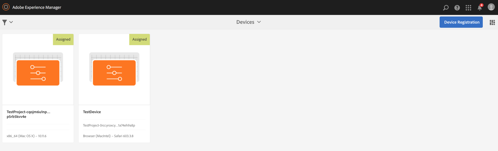

# Working with AEM Screens Player {#working-with-aem-screens-player}

AEM Screens 플레이어에서 채널 컨텐츠 및 기타 설정을 관리할 수 있습니다.

>[!NOTE]
>
>OS X AEM Screens 플레이어의 전체 화면 모드를 종료하려면 ***Ctrl+Cmd+F**를 누르십시오.*

디스플레이에 채널을 지정하면 AEM Screens 플레이어에 컨텐츠가 표시됩니다. 관리자 UI(대시보드)나 플레이어 자체에서 환경 설정을 사용하여 플레이어의 설정을 구성할 수 있습니다.

## 장치 대시보드 사용 {#using-the-device-dashboard}

AEM 작성 인스턴스를 통해 액세스할 수 있는 장치 대시보드에서 장치에 대한 환경 설정을 구성할 수 있습니다.

1. Navigate to the device dashboard from your project, for example, ***Test Project*** --&gt; ***Devices***.

   Select **Devices** and **Device Manager** from the action bar.

   

1. 장치를 클릭하여 장치 대시보드를 엽니다.

   

1. Check the **PREFERENCES** panel. You can enable/disable the **Admin UI** and **Channel Switcher** for your player from these two options.

   

### 관리자 UI {#the-admin-ui}

Enabling the **Admin UI** from the preferences panel allows the user to open the admin settings from the Screens Player. 또한 장치 대시보드에서 이 선택 사항을 비활성화하는 경우 사용자는 플레이어에서 관리자 UI를 열 수 없습니다.

Screens 플레이어에서 관리자 UI를 보려면 마우스를 사용하거나 터치를 사용할 수 있는 AEM Screens 플레이어에서 터치를 사용하여 왼쪽 위 모서리를 길게 눌러 [관리자] 메뉴를 엽니다. 등록이 완료되고 채널이 로드되면 정보가 표시됩니다.

>[!NOTE]
>
>AEM Screens 플레이어 앱 작동 시간을 확인하여 앱 상태를 확인할 수도 있습니다.

사이드 메뉴에서 구성 **옵션을 선택한 경우** 이 대화 **상자에서** Preferences **를**&#x200B;재설정하거나 **FactoryFirmware** 로 재설정할 수도 있습니다.

또한 최대 아니요에서 AEM Screens 플레이어에 보관할 최대 로그 파일 수를 지정할 **수 있습니다. 로그 파일을 저장할**&#x200B;수 있습니다. 자세한 내용은 아래 스크린샷을 참조하십시오.

>[!NOTE]
>
>펌웨어 **업데이트** 옵션은 Android 플레이어와 같은 cordova에서만 작동합니다.

AEM Screens 플레이어의 관리자 UI에서 채널 및 애플리케이션에 대한 캐시를 지울 수 있습니다.

측면 레일에서 **컨텐츠 캐시**&#x200B;를 선택하여 캐시를 업데이트하십시오.

### 채널 전환기 {#the-channel-switcher}

Enabling the **Channel Switcher** from the preferences panel allows the user to open the channel selection/settings from the Screens Player.

또한 장치 대시보드에서 이 선택 사항을 비활성화하는 경우 사용자는 Screens 플레이어에서 채널 환경 설정을 제어할 수 없습니다.

Screens 플레이어에서 채널에 대한 설정을 전환하고 제어할 수 있습니다.

플레이어에서 채널 전환기를 보려면 왼쪽 아래 모서리를 길게 눌러 채널 전환 및 기타 기능을 사용할 수 있도록 해주는 채널 전환기를 여십시오.

>[!NOTE]
>
>Screens 플레이어에서 플레이어에 대해 관리 메뉴 및 채널 전환기를 활성화하거나 비활성화할 수도 있습니다.
>
>(아래 섹션에 언급된 대로 *Screens 플레이어에서 환경 설정 변경*&#x200B;을 참조하십시오.)

### AEM Screens 플레이어에서 환경 설정 관리 {#managing-preferences-from-the-aem-screens-player}

플레이어 자체에서 관리자 UI 및 채널 전환기에 대한 설정을 변경할 수도 있습니다.

플레이어에서 환경 설정을 변경하려면 다음 절차를 따르십시오.

1. 유휴 채널에서 왼쪽 위 모서리를 길게 눌러 관리 패널을 엽니다.
1. Navigate to **Configuration** from the left action menu.
1. Enable/disable configuration for **Admin UI** or **Channel Switcher**.

## AEM Screens 플레이어 문제 해결 {#troubleshooting-aem-screens-player}

AEM Screens 플레이어와 관련된 다양한 문제를 해결할 수 있습니다(하드웨어 및 소프트웨어).

| **문제** | **추천** |
|---|---|
| 플레이어 저장소가 꽉 참 | 불필요한 파일 제거 |
| 플레이어가 네트워크 손실 | Cat-5/Cat-6 케이블을 사용합니다. wifi의 경우 라우터에서 플레이어 디바이스로의 거리를 줄입니다. |
| AEM Screens 플레이어 충돌 | AEM Screens 플레이어가 항상 실행되도록 하는 감시 응용 프로그램을 사용하는 것이 좋습니다 |
| AEM Screens 플레이어 설정 손실 | AEM 서버에 대한 연결 확인 |
| AEM Screens 플레이어는 플레이어를 다시 시작/다시 부팅한 후 자동으로 시작되지 않습니다. | OS 시작 폴더 또는 초기화 절차 확인 |
| AEM Screens 플레이어에 잘못된/이전 컨텐츠가 표시됨 | 네트워크 연결 확인 |

### AEM Screens 플레이어 업데이트 {#updates-for-aem-screens-player}

AEM Screens 플레이어용으로는 두 가지 유형의 업데이트가 있습니다.

| **메서드** | **세부 사항** | **원격** | **자동화** | **0 다운타임** |
|---|---|---|---|---|
| 펌웨어 업데이트 | 원격 명령을 통해 기존 설치된 플레이어에 적용됩니다. 업데이트 후에는 기존 컨텐츠가 플레이어에 자동으로 다시 로드됩니다. | 예 | 사용자 지정 | 거의 - 1-3초 |
| 플레이어 셸 업데이트 | 플레이어에 배포할 새 실행 파일입니다. 이 방법을 사용하려면 플레이어에서 새 바이너리를 원격 복사하고 현재 실행 중인 버전을 중지하고 새 버전을 시작해야 합니다. 이 경우 사전 로드된 패키지를 다시 다운로드해야 할 수 있습니다. | 예(원격 쉘을 통해) | 사용자 지정 | 아니오 |

## 플레이어 장치에 대한 하드웨어 선택 지침 {#hardware-selection-guidelines-for-player-device}

다음 섹션에서는 스크린 프로젝트에 대한 하드웨어 선택 지침을 제공합니다.

* PC ***플레이어와 디스플레이*** 패널 또는 프로젝터에 ***항상 상업용 또는 산업용*** 등급 구성 요소를 제공합니다.

* 디지털 사이니지 시장을 제공하는 벤더와 항상 교류할 수 있습니다.
* 항상 주위 온도 및 상대 습도와 같은 환경적 요인을 고려하십시오.
* 전원 요구 사항 및 전원 조절을 항상 검토합니다.
* 애플리케이션에 필요한 성능 요구 사항 및 입출력 포트를 신중하게 검토합니다.

다음 표는 AEM Screens 프로젝트에 대한 일반적인 사용 사례와 함께 하드웨어 구성을 요약합니다.

<table>
 <tbody>
  <tr>
   <td>플레이어 구성</td>
   <td>프로세서</td>
   <td>메모리</td>
   <td>스토리지 SSD</td>
   <td>GPU</td>
   <td>표시</td>
   <td>I/O</td>
   <td>일반적인 사용 사례</td>
  </tr>
  <tr>
   <td>기본</td>
   <td>듀얼 코어, i3 또는 엔트리 레벨 쿼드 코어 Intel® Atom 프로세서</td>
   <td>
4GB 메모리
 
2MB 캐시
 </td>
   <td>
ChromeOS 32GB
 
Windows 128GB
 </td>
   <td>OnBoard</td>
   <td>1920x1080</td>
   <td>DVI,  이더넷/무선,  2xUSB</td>
   <td>
    <ul>
     <li>표준 전체 화면 반복  </li>
     <li>하루 분할</li>
    </ul> </td>
  </tr>
  <tr>
   <td>표준</td>
   <td>쿼드 코어, Intel® Core i5 프로세서</td>
   <td>
8GB의 메모리
 
4MB 캐시
 </td>
   <td>128GB</td>
   <td>OnBoard</td>
   <td>3840x2160(4K)</td>
   <td>DVI, HDMI  이더넷/무선,  2xUSB</td>
   <td>
    <ul>
     <li>단일 소스 동적 컨텐츠</li>
     <li>간단한 인터랙티브</li>
     <li>1-3 영역 레이아웃</li>
    </ul> </td>
  </tr>
  <tr>
   <td>고급</td>
   <td>하이퍼스레딩(hyperthreading) 기술이 적용된 쿼드 코어, Intel® Core i7 프로세서</td>
   <td>
16GB의 메모리
 
8MB 캐시
 </td>
   <td>256GB</td>
   <td>전용 그래픽 GPU</td>
   <td>3840x2160(4K)</td>
   <td>DVI, HDMI  이더넷/무선,  4xUSB</td>
   <td>
    <ul>
     <li>4개 이상의 컨텐츠 영역, 동시 비디오 재생</li>
     <li>인터랙티브한 다중 페이지</li>
     <li>다중 소스 데이터 트리거</li>
    </ul> </td>
  </tr>
 </tbody>
</table>
